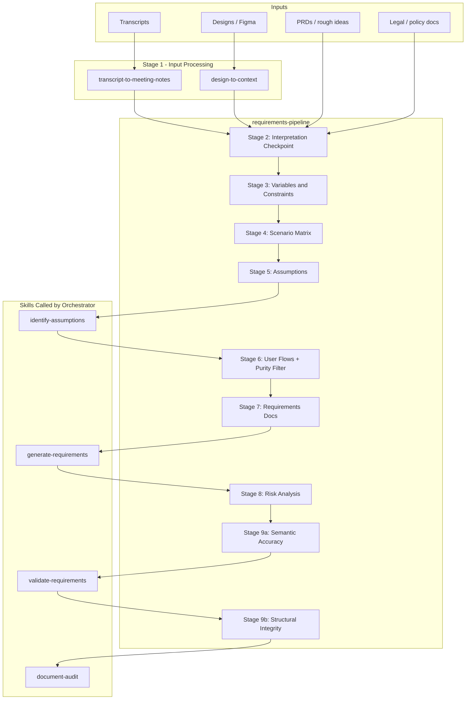
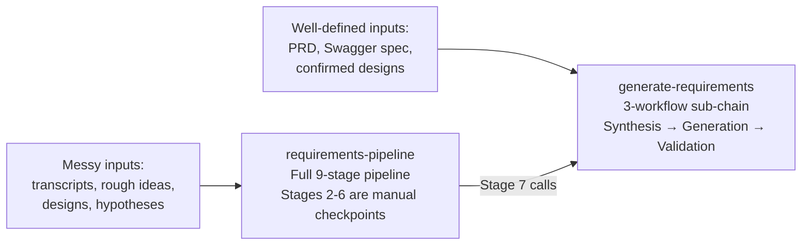
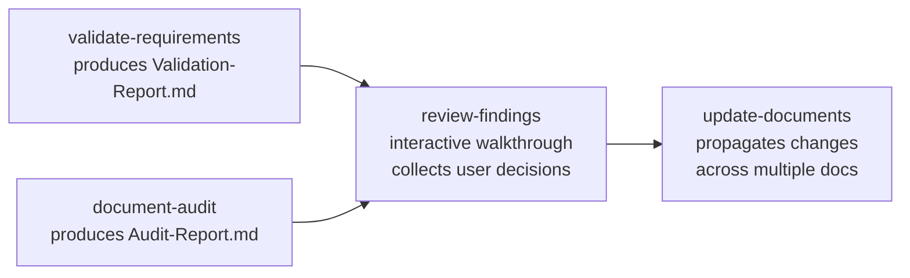
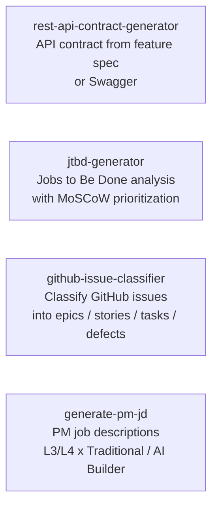
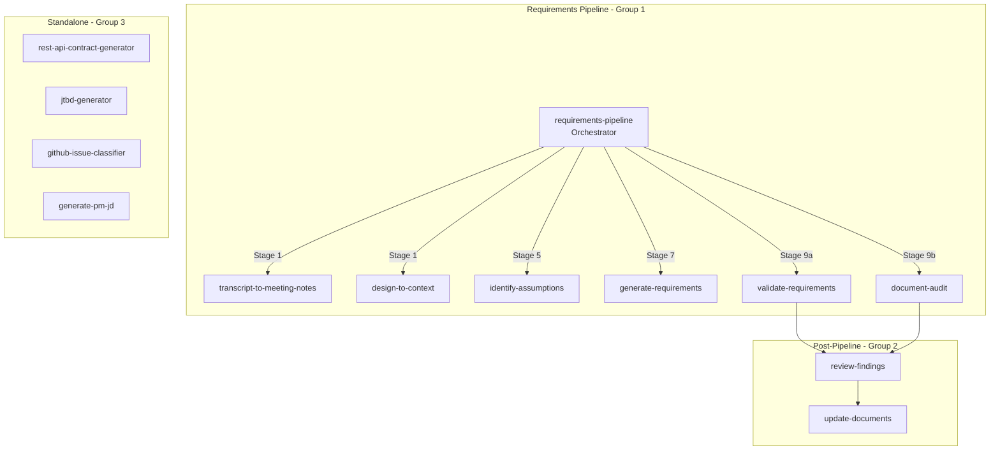

# Workflow Guide

How the skills relate to each other, which ones form a pipeline, which are standalone, and when to use each entry point.

---

## Skill Groups

All 13 product skills fall into three groups:

| Group | Skills | Description |
|-------|--------|-------------|
| **1 — Full Pipeline** | requirements-pipeline (orchestrator) + 6 called skills | End-to-end requirements generation from raw inputs |
| **2 — Post-Pipeline** | review-findings, update-documents | Review and propagate changes after docs are created |
| **3 — Standalone** | rest-api-contract-generator, jtbd-generator, github-issue-classifier, generate-pm-jd | Independent skills with no pipeline relationship |

---

## Group 1: The Full Requirements Pipeline

`requirements-pipeline` is the master orchestrator. It runs a 9-stage pipeline and calls six other skills at specific stages. Each of those skills can also be run independently.

### Stages and What They Produce

| Stage | What Happens | Output Artifact |
|-------|-------------|-----------------|
| 1 | Transcripts and designs are pre-processed into structured summaries | Meeting summary, User Flow Doc or Context Summary |
| 2 | Interpretation checkpoint — STATED vs INFERRED facts, user confirms | Inference Register |
| 3 | Variables, constraints, and actors mapped | Variables table |
| 4 | Scenario matrix — all combinations, edge cases, boundary conditions | `[Feature]-Scenarios-Matrix.md` |
| 5 | Risky assumptions identified per perspective (PM / Designer / Engineer) | Assumptions register |
| 6 | Step-by-step user flows per actor + purity filter (requirement vs solution vs design) | `[Feature]-User-Flows.md` |
| 7 | Feature Requirements, API Contract (if applicable), System Flow (if applicable) | `Feature-Requirements-[Feature].md`, optionally `API-Contract-[Feature].md`, `System-Flow-[Feature].md` |
| 8 | Pre-mortem risk analysis — Tigers / Paper Tigers / Elephants | Risks section merged into requirements doc |
| 9a | Semantic accuracy review — 10 checks across truth, purity, actionability, completeness | `Validation-Report-[Feature].md` |
| 9b | Structural integrity sweep — stale markers, contradictions, broken cross-refs | Audit report, fixes applied |

### Two Entry Points for Requirements Generation

**Use `requirements-pipeline` when:**
- Starting from rough ideas, brainstorming sessions, or meeting notes
- Inputs are incomplete or contradictory and need clarification
- You want scenario matrices and assumptions analysis before writing requirements
- This is a complex feature that needs multi-perspective stress-testing

**Use `generate-requirements` directly when:**
- You already have a clear PRD, Figma designs, and/or Swagger spec
- Requirements are well-scoped and inputs are trustworthy
- You need a quick turnaround (Quick Mode: ~20 min vs full pipeline: ~2 hrs)
- You're updating an existing requirements doc with incremental changes

---

## Group 2: Post-Pipeline Chain

After requirements documents are created, this two-skill chain handles reviews and cross-document propagation.

| Skill | Trigger |
|-------|---------|
| **review-findings** | After `validate-requirements` or `document-audit` produces a report — walk through findings and decide what to fix |
| **update-documents** | After `review-findings` collects decisions, or when any stakeholder feedback / design change needs to cascade across multiple docs |

### When to Use Each Post-Pipeline Skill

**`review-findings`** — Use this when you want to systematically work through findings rather than handle them ad-hoc. It presents findings via structured questions (accept / reject / defer per finding) and produces a resolution summary you can hand off.

**`update-documents`** — Use this when a confirmed change (corrected fact, scope cut, renamed concept, new decision) needs to be reflected across multiple related documents simultaneously. It shows you a change manifest for approval before touching any file.

---

## Group 3: Standalone Skills

These four skills have no dependency on the pipeline and are invoked directly.

| Skill | Use When |
|-------|----------|
| **rest-api-contract-generator** | You need a standalone API contract for a feature — not as part of a full requirements pipeline |
| **jtbd-generator** | You want to define scope through user jobs (ODI framework) — for discovery, stakeholder alignment, or MVP scoping |
| **github-issue-classifier** | You have a GitHub issue dump from the Github-Issue-Extractor tool and need to categorize and hierarchy-map it |
| **generate-pm-jd** | You need to write a Product Manager job description for a client engagement at Robots & Pencils |

---

## Full Skill Relationship Map

---

## Choosing the Right Starting Point

| Situation | Start Here |
|-----------|-----------|
| "I have a meeting transcript and some rough ideas for a feature" | `requirements-pipeline` |
| "I have a Figma link and a PRD, I need requirements" | `generate-requirements` |
| "I have a design with no other context" | `design-to-context` first, then `generate-requirements` |
| "I have a transcript from a discovery call" | `transcript-to-meeting-notes` first, then feed output to `generate-requirements` |
| "I need to validate an existing requirements doc" | `validate-requirements` → `review-findings` |
| "A decision changed and I need to update 4 docs" | `update-documents` |
| "I need an API contract for a new endpoint" | `rest-api-contract-generator` |
| "I need to define MVP scope through user needs" | `jtbd-generator` |
| "I have a GitHub issue dump I need to make sense of" | `github-issue-classifier` |
| "I need to write a PM job description" | `generate-pm-jd` |
