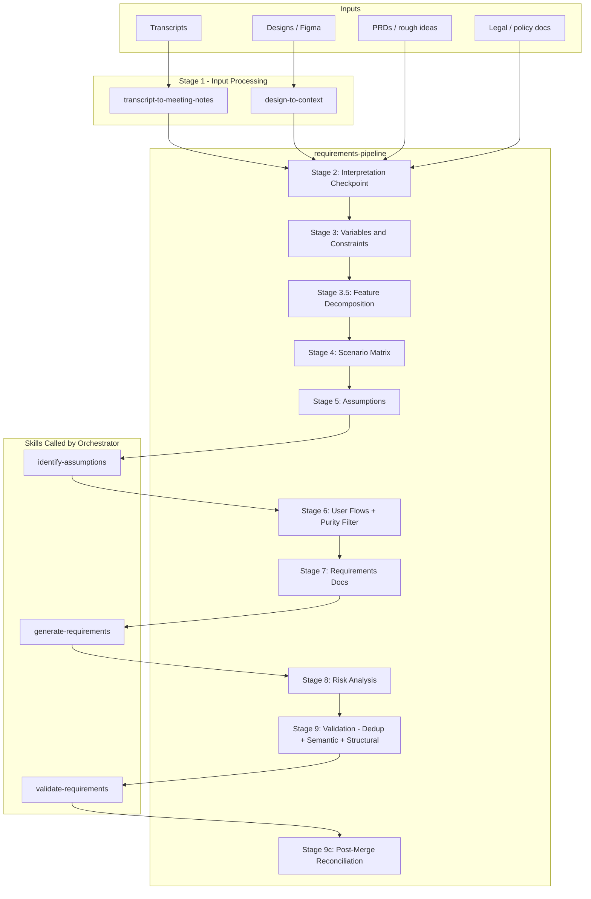
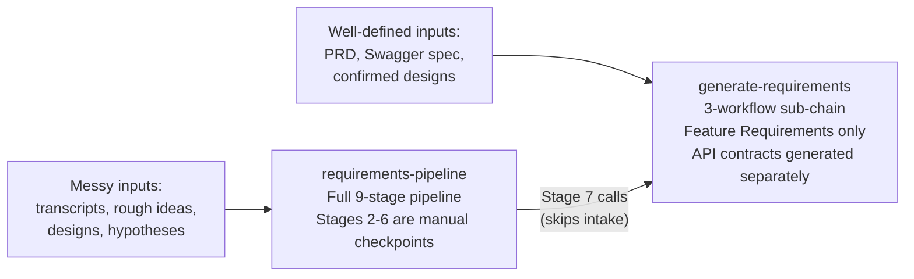
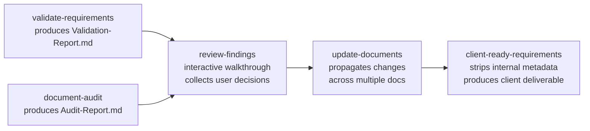
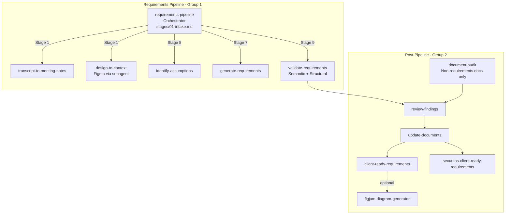

# Workflow Guide

How the skills relate to each other, which ones form a pipeline, which are standalone, and when to use each entry point.

---

## Skill Groups

All 12 product skills fall into two groups:

| Group | Skills | Description |
|-------|--------|-------------|
| **1 — Full Pipeline** | requirements-pipeline (orchestrator) + 6 called skills | End-to-end requirements generation from raw inputs |
| **2 — Post-Pipeline** | review-findings, update-documents, client-ready-requirements, figjam-diagram-generator, securitas-client-ready-requirements | Review, propagate changes, visualize, and deliver client-ready output after docs are created |

---

## Group 1: The Full Requirements Pipeline

`requirements-pipeline` is the master orchestrator. It runs a 9-stage pipeline and calls six other skills at specific stages. Each of those skills can also be run independently.

### Stages and What They Produce

| Stage | What Happens | Output Artifact |
|-------|-------------|-----------------|
| 1 | Transcripts and designs are pre-processed into structured summaries | Meeting summary, User Flow Doc or Context Summary |
| 2 | Interpretation checkpoint — STATED vs INFERRED facts, user confirms | Inference Register |
| 3 | Variables, constraints, and actors mapped | Variables table |
| 3.5 | Feature decomposition — cluster value streams, test independence, build Shared Registry | `Stage3.5-Feature-Decomposition.md` |
| 4 | Scenario matrix — all combinations, edge cases, boundary conditions | `[Feature]-Scenarios-Matrix.md` |
| 5 | Risky assumptions identified per perspective (PM / Designer / Engineer) | Assumptions register |
| 6 | Step-by-step user flows per actor + purity filter (requirement vs solution vs design) | `[Feature]-User-Flows.md` |
| 7 | Feature Requirements document generated (API contracts and system flows are separate, post-requirements skills) | `Feature-Requirements-[Feature].md` (saved to user-provided output folder) |
| 8 | Pre-mortem risk analysis — Tigers / Paper Tigers / Elephants | Risks section merged into requirements doc |
| 9 | Combined validation — deduplication + 15-check semantic and structural review | `Stage9-Validation-Report.md` |
| 9c | Post-merge reconciliation (multi-feature only) — cross-document dedup, conflict detection | `Stage9c-Reconciliation.md` |

### Two Entry Points for Requirements Generation

**Use `requirements-pipeline` when:**
- Starting from rough ideas, brainstorming sessions, or meeting notes
- Inputs are incomplete or contradictory and need clarification
- You want scenario matrices and assumptions analysis before writing requirements
- The feature is complex enough to warrant stage-by-stage confirmation
- You have a `project-context.md` and want it automatically applied across all stages

**Use `generate-requirements` directly when:**
- You already have a clear PRD, Figma designs, and/or Swagger spec
- Requirements are well-scoped and inputs are trustworthy
- You need a quick turnaround (Quick Mode: ~15 min vs full pipeline: ~2 hrs)
- You're updating an existing requirements doc with incremental changes

**After requirements are finalized**, generate API contracts and system flows separately.

---

## Group 2: Post-Pipeline Chain

After requirements documents are created, this three-skill chain handles reviews, cross-document propagation, and client delivery.

| Skill | Trigger |
|-------|---------|
| **review-findings** | After `validate-requirements` or `document-audit` produces a report — walk through findings and decide what to fix |
| **update-documents** | After `review-findings` collects decisions, or when any stakeholder feedback / design change needs to cascade across multiple docs |
| **client-ready-requirements** | After internal requirements are finalized and validated — produce a clean version to share with client stakeholders |

### When to Use Each Post-Pipeline Skill

**`review-findings`** — Use this when you want to systematically work through findings rather than handle them ad-hoc. It presents findings via structured questions (accept / reject / defer per finding) and produces a resolution summary you can hand off.

**`update-documents`** — Use this when a confirmed change (corrected fact, scope cut, renamed concept, new decision) needs to be reflected across multiple related documents simultaneously. It shows you a change manifest for approval before touching any file.

**`client-ready-requirements`** — Use this when the internal requirements document is complete and validated and you need to share it with the client. It strips all internal metadata (SRC codes, pipeline stage markers, assumption codes) without changing any requirement content, and adds a formatted Sources & Reference Materials section.

---

## Full Skill Relationship Map

---

## Choosing the Right Starting Point

| Situation | Start Here |
|-----------|-----------|
| "I have a meeting transcript and some rough ideas for a feature" | `requirements-pipeline` |
| "I have a Figma link and a PRD, I need requirements" | `generate-requirements` (Feature Requirements only; API contracts generated separately after) |
| "I have a design with no other context" | `design-to-context` first, then `generate-requirements` |
| "I have a transcript from a discovery call" | `transcript-to-meeting-notes` first, then feed output to `generate-requirements` |
| "I need to validate an existing requirements doc" | `validate-requirements` → `review-findings` |
| "A decision changed and I need to update 4 docs" | `update-documents` |
| "Internal requirements are done — I need a clean version for the client" | `client-ready-requirements` |
