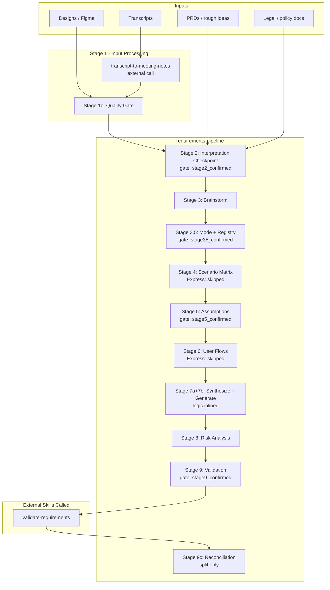
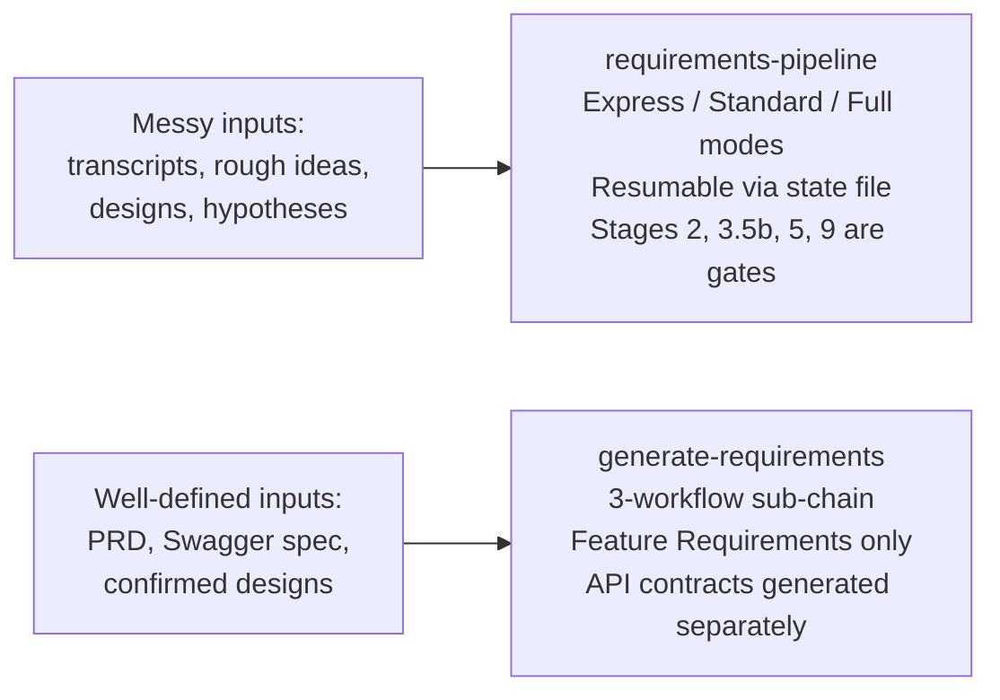
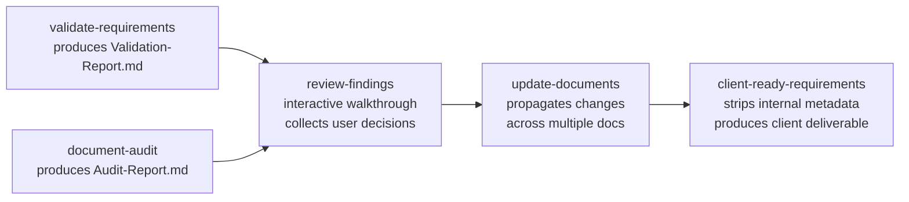
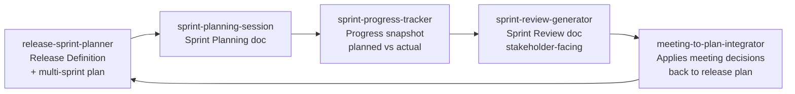
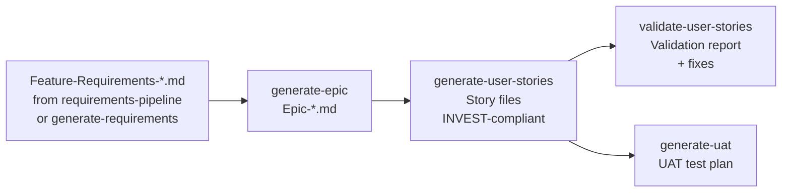
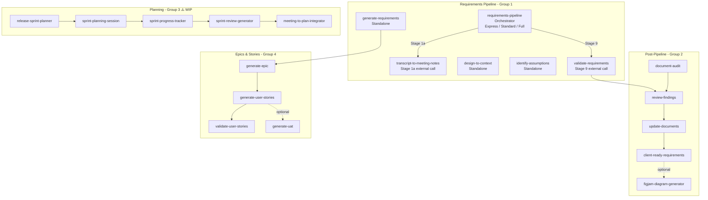

# Workflow Guide

How the skills relate to each other, which ones form a pipeline, which are standalone, and when to use each entry point.

---

## Skill Groups

All 20 skills fall into four groups:

| Group | Skills | Description |
|-------|--------|-------------|
| **1 — Requirements Pipeline** | requirements-pipeline (orchestrator) + 6 supporting skills | End-to-end requirements generation from raw inputs |
| **2 — Post-Pipeline** | review-findings, update-documents, client-ready-requirements, figjam-diagram-generator | Review, propagate changes, visualize, and deliver client-ready output |
| **3 — Planning** ⚠️ WIP | release-sprint-planner, sprint-planning-session, sprint-progress-tracker, sprint-review-generator, meeting-to-plan-integrator | Full delivery lifecycle from release definition through sprint execution and review |
| **4 — Epics & Stories** | generate-epic, generate-user-stories, validate-user-stories, generate-uat | Story lifecycle from epic creation through UAT |

---

## Group 1: The Full Requirements Pipeline

`requirements-pipeline` is the master orchestrator. It runs a multi-stage pipeline with three modes (Express / Standard / Full) and produces a resumable state file. Only two external skills are called — all other logic is inlined in stage files.

### Stages and What They Produce

| Stage | What Happens | Output Artifact | Mode |
|-------|-------------|-----------------|------|
| 1a | Input scoping — three-tier gate locks input set, assigns SRC-IDs; transcripts routed to `transcript-to-meeting-notes` | `source_summaries/` files | All |
| 1b | Quality gate — input quality rated, pipeline mode pre-assessed | Stage 1b notes in state file | All |
| 2 | Interpretation checkpoint — STATED vs INFERRED facts, user confirms | Inference register; `stage2_confirmed` gate | All |
| 3 | Brainstorm — constraints, new rules, actor interaction map | Stage 3 artifact | All |
| 3.5a | Split analysis — tests whether multi-feature decomposition is needed | Split signal | All |
| 3.5b | Mode + registry — mode locked (Express/Standard/Full), Shared Registry built | `03.5b-mode-registry.md`; `stage35_confirmed` gate | All |
| 3.5c | Execution model — staggered-parallel plan for split runs | Execution plan | Split only |
| 4 | Scenario matrix — combinations, edge cases, boundary conditions | `04-scenarios.md` | Standard / Full |
| 5 | Assumptions — risky assumptions by priority (PM / Designer / Engineer perspectives, inlined) | Assumptions register; `stage5_confirmed` gate | All |
| 6 | User flows per actor + purity filter (requirement vs solution vs design) | `06-user-flows.md` | Standard / Full |
| 7a | Synthesis — reads all stage artifacts, prepares context for generation | Synthesis notes | All |
| 7b | Generation — writes Feature Requirements document (logic inlined) | `07b-feature-requirements.md` | All |
| 8 | Risk analysis — pre-mortem (Tigers / Paper Tigers / Elephants) | Risk section in requirements doc | All |
| 9 | Validation — calls `validate-requirements`; combined semantic + structural review | `09-validation-report.md`; `stage9_confirmed` gate | All |
| 9c | Post-merge reconciliation — cross-document dedup, conflict detection | `09c-reconciliation.md` | Split only |

### Two Entry Points for Requirements Generation

**Use `requirements-pipeline` when:**
- Starting from rough ideas, brainstorming sessions, or meeting notes
- Inputs are incomplete or contradictory and need clarification
- You want scenario matrices and assumptions analysis before writing requirements
- The feature is complex enough to warrant stage-by-stage confirmation
- You have a `project-context.md` and want it automatically applied across all stages
- You need to resume a prior run after a session ends (Express mode for quick turnarounds)

**Use `generate-requirements` directly when:**
- You already have a clear PRD, Figma designs, and/or Swagger spec
- Requirements are well-scoped and inputs are trustworthy
- You need a quick turnaround (Quick Mode: ~15 min vs full pipeline: ~2 hrs)
- You're updating an existing requirements doc with incremental changes

**After requirements are finalized**, generate API contracts and system flows separately.

---

## Group 2: Post-Pipeline Chain

After requirements documents are created, this three-skill chain handles reviews, cross-document propagation, and client delivery.

| Skill | Trigger |
|-------|---------|
| **review-findings** | After `validate-requirements` or `document-audit` produces a report — walk through findings and decide what to fix |
| **update-documents** | After `review-findings` collects decisions, or when any stakeholder feedback / design change needs to cascade across multiple docs |
| **client-ready-requirements** | After internal requirements are finalized and validated — produce a clean version to share with client stakeholders |

### When to Use Each Post-Pipeline Skill

**`review-findings`** — Use this when you want to systematically work through findings rather than handle them ad-hoc. It presents findings via structured questions (accept / reject / defer per finding) and produces a resolution summary you can hand off.

**`update-documents`** — Use this when a confirmed change (corrected fact, scope cut, renamed concept, new decision) needs to be reflected across multiple related documents simultaneously. It shows you a change manifest for approval before touching any file.

**`client-ready-requirements`** — Use this when the internal requirements document is complete and validated and you need to share it with the client. Produces an 11-section VP/Director-ready document with VP filter applied, deduplication, and overflow content moved to appendices. FR statements are copied verbatim — no paraphrasing.

---

## Group 3: Planning ⚠️ WIP

Five interconnected skills covering the full delivery lifecycle. Skills read each other's output files — no skill depends on chat context from another skill's run.

| Skill | Input | Output |
|-------|-------|--------|
| **release-sprint-planner** | Feature list, team, timeline, constraints | `Release-Definition.md`, `Release-Plan.md`, `Scope.md` |
| **sprint-planning-session** | Release plan or ticket list | `Sprint-N-Planning.md` |
| **sprint-progress-tracker** | Sprint planning doc + status updates | `Sprint-N-Progress.md` |
| **sprint-review-generator** | Sprint progress doc | `Sprint-N-Review.md` |
| **meeting-to-plan-integrator** | Meeting notes / sprint review | Updated `Release-Plan.md` and related artifacts |

**Use `release-sprint-planner` once per release** to define the goal, scope, and sprint breakdown. Then run the remaining four skills each sprint in sequence.

---

## Group 4: Epics & Stories

Four skills covering the story lifecycle — from epic creation through acceptance testing.

| Skill | Purpose |
|-------|---------|
| **generate-epic** | Creates a structured epic from requirements or a verbal description — extracts goals, success criteria, scope, dependencies |
| **generate-user-stories** | Decomposes an epic into INVEST-compliant stories using WAHZURT framework; 4 modes: create, quick/draft, modify, decompose-only |
| **validate-user-stories** | Audits stories against 12 categories; fixes failures; always rebuilds registry from actual files |
| **generate-uat** | Generates a client-ready UAT test plan from GitHub issue files or a ticket list |

---

## Full Skill Relationship Map

---

## Choosing the Right Starting Point

| Situation | Start Here |
|-----------|-----------|
| "I have a meeting transcript and some rough ideas for a feature" | `requirements-pipeline` |
| "I have a Figma link and a PRD, I need requirements" | `generate-requirements` |
| "I have a design with no other context" | `design-to-context` first, then `generate-requirements` |
| "I have a transcript from a discovery call" | `transcript-to-meeting-notes` first, then `generate-requirements` |
| "I need to validate an existing requirements doc" | `validate-requirements` → `review-findings` |
| "A decision changed and I need to update multiple docs" | `update-documents` |
| "Internal requirements are done — I need a client version" | `client-ready-requirements` |
| "I want to visualize a user flow or requirements doc" | `figjam-diagram-generator` |
| "I need to stress-test the assumptions behind a feature" | `identify-assumptions` |
| "I need to plan a release and break it into sprints" | `release-sprint-planner` |
| "I need to plan the upcoming sprint" | `sprint-planning-session` |
| "I want a mid-sprint status snapshot" | `sprint-progress-tracker` |
| "I need to prepare the sprint review doc" | `sprint-review-generator` |
| "Meeting decisions need to go back into the release plan" | `meeting-to-plan-integrator` |
| "I need to write an epic from requirements" | `generate-epic` |
| "I need to create user stories for an epic" | `generate-user-stories` |
| "I need to validate or fix existing user stories" | `validate-user-stories` |
| "I need a UAT test plan from our tickets" | `generate-uat` |
